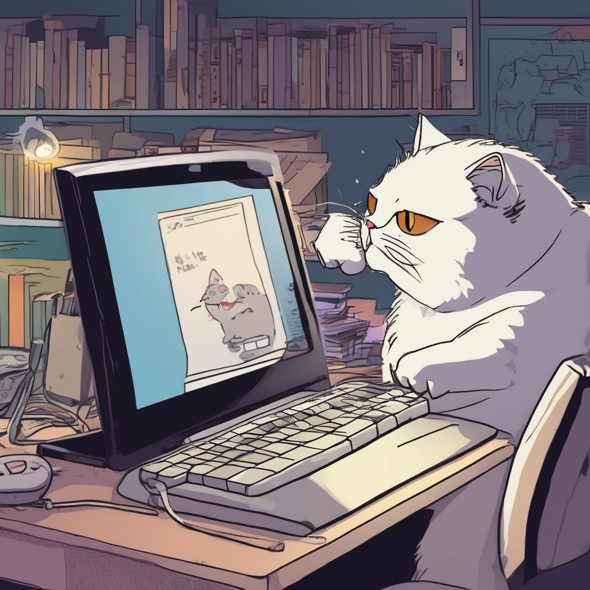

# GenZMeme

**MemeGen API** is a custom-built image generation API that allows you to generate meme images from text prompts using **Stable Diffusion XL**. The API is powered by **FastAPI** and is hosted in a **Docker container** with **GPU support** for optimal performance.

This project is designed to be easily deployable on any server with Docker and GPU capabilities.

## Features

- **Text-to-Image Generation**: Use a text prompt to generate meme images.
- **FastAPI**: A fast and modern web framework for building APIs.
- **Stable Diffusion XL**: A powerful image generation model.
- **GPU Support**: Utilizes GPU for faster image generation.
- **Custom Docker Image**: Built and packaged with all dependencies pre-installed.

## System Requirements

- **GPU**: A server with an **NVIDIA GPU** (for CUDA support).
- **VRAM**: Minimum **16GB VRAM**.
- **Docker**: Installed and running on the server. If Docker is not installed, please follow [this guide](https://docs.docker.com/get-docker/).
- **Python**: Python 3.9 or higher.
  
## Project Structure

- **FastAPI**: The API is built using the **FastAPI** framework for fast, asynchronous web requests.
- **Docker**: The entire application, including all dependencies (like **Stable Diffusion XL** and **FastAPI**), is bundled in a custom Docker container.
  
## How to Deploy

- Import MemeGenZ-SDXL template on Nosana dashboard 
- Click deploy (Yep that was easy!!!)

## Usage

There are two custom api endpoints:

**/** -> This is just for testing that server is up.

### **/generate**   

**Do a POST request containing the text prompt.**

```json
{   
  "text": "A cartoon-style meme of a cat typing furiously on a computer, dramatic lighting, meme aesthetic"
}
```
**Response:** 
```json
{
    "image":"base64 url"
}
```
Response will be image encoded in base64 url, decode it using base64 decoder [Base64](https://codebeautify.org/base64-to-image-converter).

## Test and Proof of Work

I have given prompt: **A cartoon-style meme of a cat typing furiously on a computer, dramatic lighting, meme aesthetic**

After decoding received base64 to image:


You have your meme ready !! Share it !!
