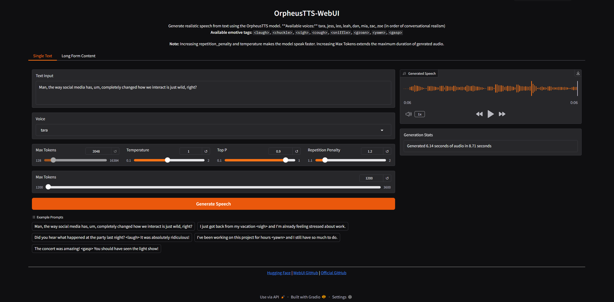

## Orpheus TTS

Orpheus TTS is a SOTA open-source text-to-speech system built on the Llama-3b backbone. Orpheus demonstrates the emergent capabilities of using LLMs for speech synthesis.

### Requirements
- Python 3.10+
- CUDA-capable GPU (tested on RTX 3090 / 4090)
- WSL2 or Linux
- PyTorch 2.6.0 with CUDA
- Hugging Face account with access to the Orpheus TTS models
- 16 GB VRAM
## Features

- Memory Optimized: Addresses common memory issues on consumer GPUs
- Voice Selection: Access to all 8 voices from the original model
- Emotive Tags Support: Full support for all emotion tags

## Deployment Guide

### **1. Deploy via Nosana Dashboard**
1. Open the [Nosana Dashboard](https://dashboard.nosana.io).
2. Select the **orpheus-tts-webui** template.
3. Click deploy. **Yep that's it!!**

---

## Demo UI

## Demo Output
[Output](https://github.com/Saganaki22/OrpheusTTS-WebUI/tree/main?tab=readme-ov-file)

**Finetune model by tweaking template a little bit**

Check out github : [Github](https://github.com/Saganaki22/OrpheusTTS-WebUI)
Check out docs : [Github](https://github.com/Saganaki22/OrpheusTTS-WebUI/tree/main?tab=readme-ov-file)